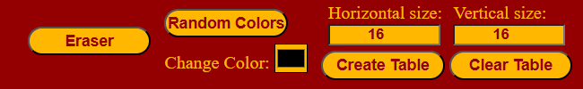

# Etch a Sketch Project
## About the Project
This project was made as part of The Odin Project <a href="https://www.theodinproject.com/lessons/foundations-rock-paper-scissors">curriculum</a>.

Etch a Sketch is a mechanical drawing toy that has a thick, flat gray screen in a red plastic frame. There are two white knobs on the front of the frame in the lower corners. Twisting the knobs moves a stylus that displaces aluminum powder on the back of the screen, leaving a solid line. (https://en.wikipedia.org/wiki/Etch_A_Sketch)

In this project I created something similar. Here I created a canvas, made of squares where you can draw using the mouse. The project has two drawing modes, using random colors or colors of your choice, an eraser for removing a mistake in the drawing and the ability to clear or create a new canvas with the same number of square, more or less. The colors used for the page are inspired by the original board colors.

Live demo: https://alinc10.github.io/Etch-a-Sketch/

## How It's Made
Tech used: HTML, CSS, JavaScript

To make the project I created some function and added some event listeners to the canvas and the to the buttons and input elements:
- I took advantage of the bubbling phase and added one event listener for the elements below to optimize the page(with the exception of horizontal and vertical size that are separate for making the code easier to read);

- the size inputs are made to have the same values, to create a square canvas with square elements;
- the draw variable is used to decide if the user wants to color(draw === 1) or if he wants to erase(draw === 0);
- the drawMode variable is used to decide if the user wants to draw with his colors(drawMode === 1) or he wants random colors(drawMode === 0);
- createGrid() function creates the squares which will be colored by the user based on the horizontal and vertical sizes;
- removeGrid() function deletes that squares and calls createGrid() function to create new square;
- randomColor() function returns a number between 0 - 255 that will be used for the random drawing mode;
- the drawing and erasing are made using 3 event listeners, one for when left click is pressed that activates the second one when cursor is hovering on the canvas and the third event listeners activates when left click is released and it removes the hover event listener;
- the coloring is based on the drawMode, 1 that let's the user to choice colors and 0 that gives random colors.

## Lessons Learned:
- how to use bubbling phase to not use a lot of event listeners and optimize code;
- the importance of for(...) loop to make the same thing multiple time